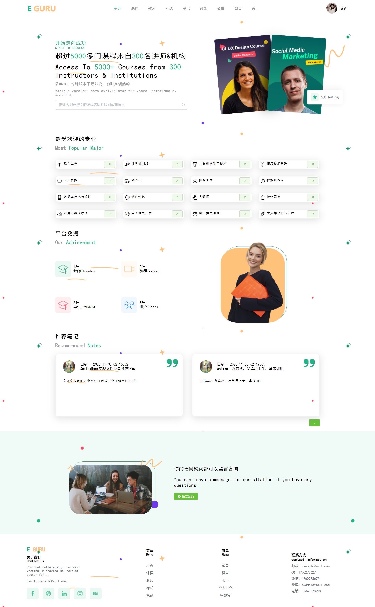
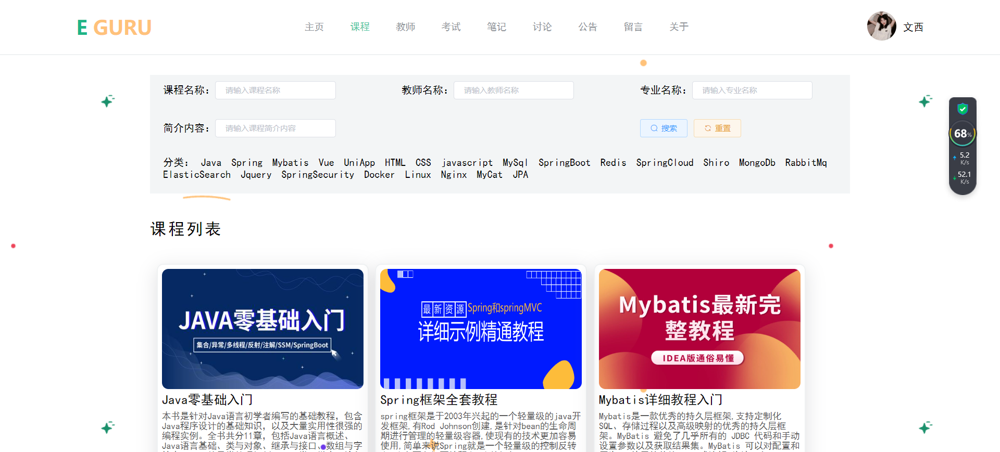
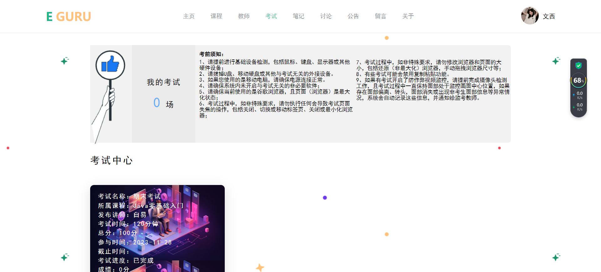
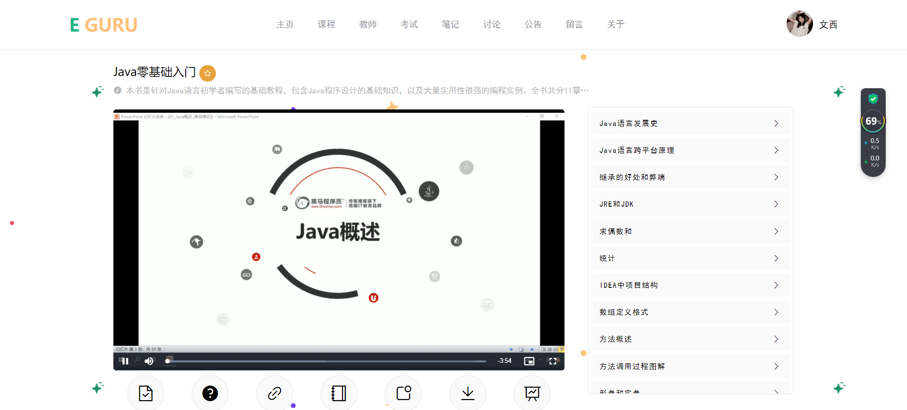

# learn-server基于SpringBoot+Vue的在线学习系统的设计与实现

#### 介绍
 **功能：** 
用户：登录、注册、主页、课程、报名课程、视频播放学习、课程答疑、讲师详情、课程笔记、章节作业、下载课件、学习进度、在线考试、自动评分、公告列表、留言列表、关于、个人中心、我的课程、我的收藏、记笔记、我的作业、我的笔记、收藏笔记、错题集、退出登录
教师：登录、教师注册、教师首页、教师课程管理、教师章节管理、学生笔记、考试管理、阅卷、考试题目录入、课程答疑、讨论管理、个人中心
管理员：登录、首页、学校管理、专业管理、留言管理、课程管理、课程分类、章节管理、笔记管理、讨论管理、考试管理、教师管理、学生管理、通知公告、个人中心
 **采用技术：** SpringBoot，shiro，Mybatis-plus，Vue，redis，mysql，ElementUi，echarts
 **工具：** idea，vscode，navicat
 **系统截图：** 

